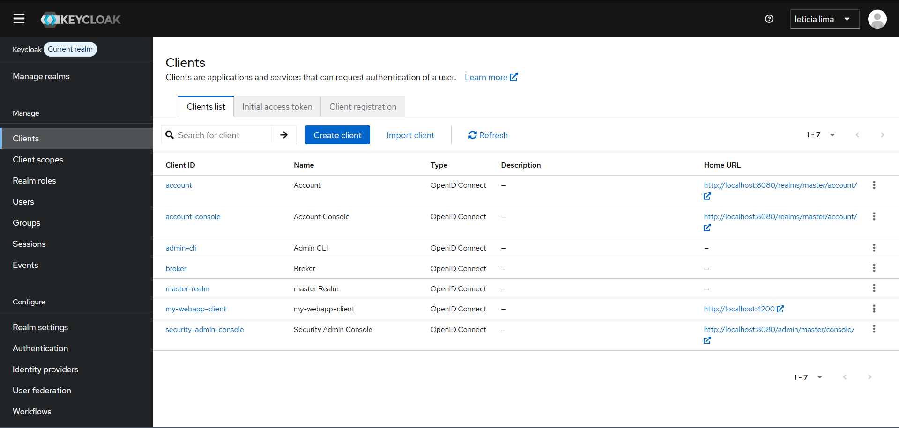

# Keycloak Local Setup

Simple Keycloak setup for local development with PostgreSQL.



## What it starts

- Keycloak on `http://localhost:8080`
- PostgreSQL on `localhost:5433`

## Start

```bash
cp env_example .env
docker compose up -d
```

## Default login

- Username: `admin`
- Password: `admin`

Change these values in `.env` if needed.